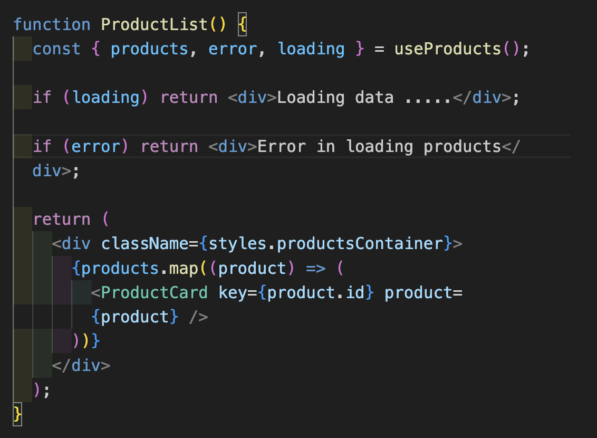

# Step By Step Algo for this Project

## STEP - 1 :

Pehele step mai hum ek API le lenge jisme mock data rahega products ka aur us mock data ko use karenge hum ek custom hook mai (useProducts.js), vo custom hook ka ye kaam hoga. Custom hook bana lene se code clean rahega aur uska data kahi bhi use ho jayega. 

<ol>
<li>States define karna:</li>
 
<ol>
<li>Products ke liye (products and setProducts) ye ek <b><u><i>empty array</b></u></i> hoga. </li>
 
<li>Ek state hogi for error (error, setError) iski default value <i><u><b>null</b></u></i> hogi, jo ki API fail hone par (error condition) mai user ko batayega ki kya error hai.</li>
 
<li>Ek state hogi loading (loading, setLoading) iski default value <b><u><i>true</b></u></i> hogi, ye badically UI par show karega loading.. us interval ke beech jab API data fetch karegi aur show hoga data UI par.  </li>
 
 
</ol>
<li>useEffect hook - is step mai ek function (fetchData) define karenge useEffect mai jo data fetch karenga, ye function async function hoga.</li>
 
<ol>
<li>Within this function fetchData try, catch aur finally ka block bana lena.</li>
 
<ul>
<li>Try block mai actual API call hoga using fetch agar ye data <b><u><i> ok nahi hai (use ! for that see the logic) </b></u></i> </li> to throw new Error ("Network response was not ok") next step jo ki else mai hi fall karega usme ye data ko json mai convert karna aur store kar lena kissi variable mai aur setProducts mai pass kar dena. 
<li>Catch block is for cathing error aur isme console log hoga -  console.log("Error fetching the products ", error); aur  setError("Error in loading"); </li>
<li>Finally mai sirf setLoading ko false kar dena hai</li>
</ul>
 
<li>Function ko call karna within useEffect aur uska dependency arrray empty rahega.</li>
 
<li>Within useProduct function return {products, loading, error}</li>
</ol>
 
 
<li>Finally export default useProduct aur hook ready hai</li>
</ol>

## STEP - 2

Is step mai components banane hai aur useProducts wale data ko present karna hai component mai, but pehele ek structure bana lenge components ka pure project mai jo rehene wala hai. Har WebApp par basically 3 component hote hai Header then Body aur last mai Footer. Mai kya karunga ki ek skeleton code for Header, Body aur Footer ka likh dunga. Us ke baas for a better scenario pehele ek component bana lete hai named as productList usme list mai sare data ko present kar denge, ye ek template hoga to know API theek call ho raha hai ya nahi. But what we want to achieve is to create 2 component 

1. ProductList -  isme ek product ki list hogi, isko banane ke liye sabse pehele hook (useProducts) ko import kar lo inside this component uske baad phir ye do contition check karo - if (loading) return a div Loading data .... and second condition if (error) return a div Error in loading products. Once ye dono check clear ho jate hai to phir Products par map function use karo aur ProductCard component ko call karo us map mai aur Products ko pass kar do as props see below code. Samajh aa jayega code se

2. ProductCard - ye ek component hoga jisme product ki details hongi jaise ki product ka name, choti si description, thubnail, Rating. Isko banane ke liye product as a prop accept karo. Maine starts bhi add kiye hai product card mai vo stars add karne ka logic likha hai renderStars file mai jo utils mai hai. 

jab ye do component ban jayenge to inko Body mai place kar diya jayega. Aur body ko App.jsx mai call kiya jayega. 